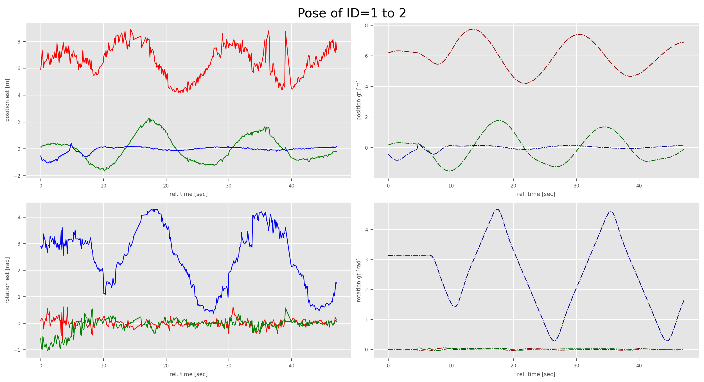
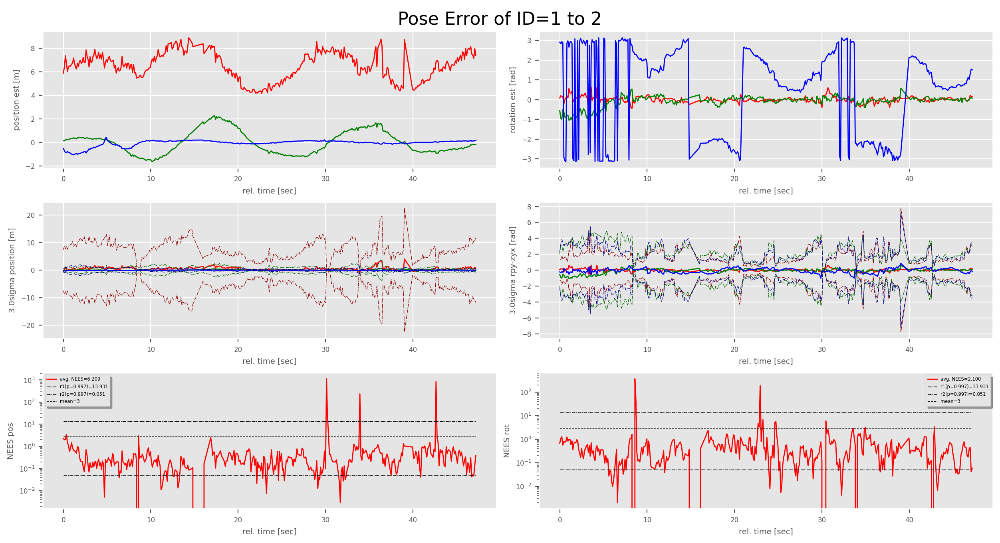
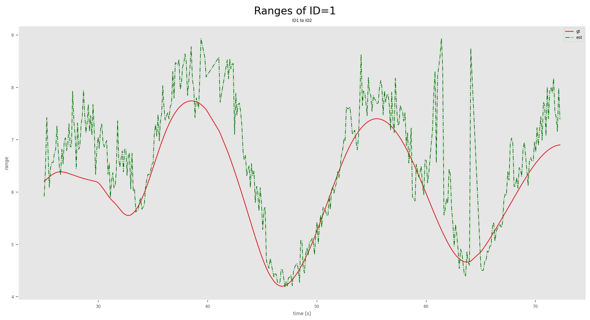
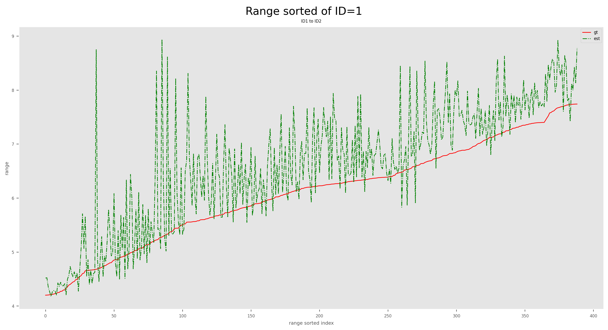
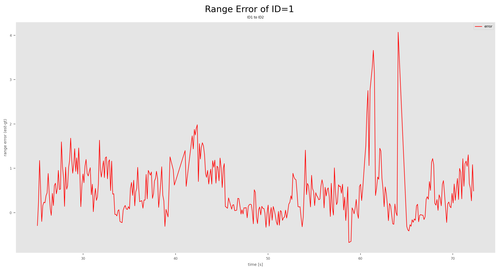
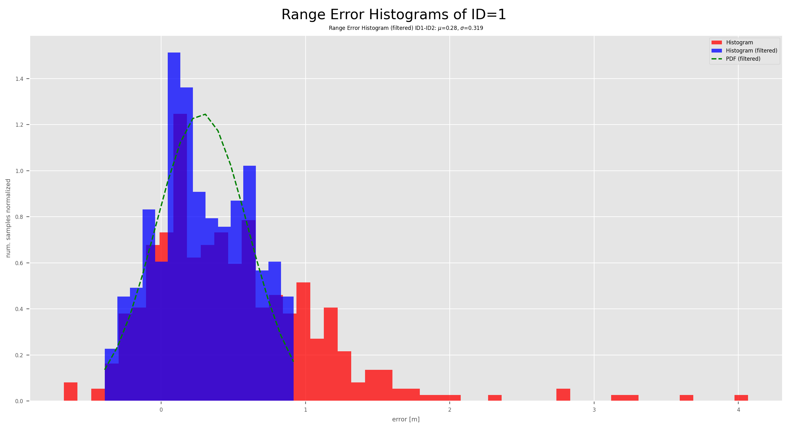
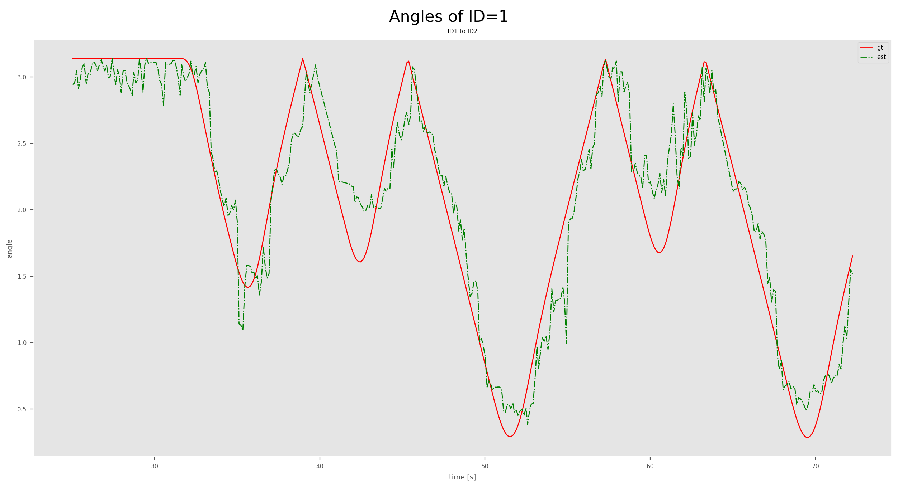
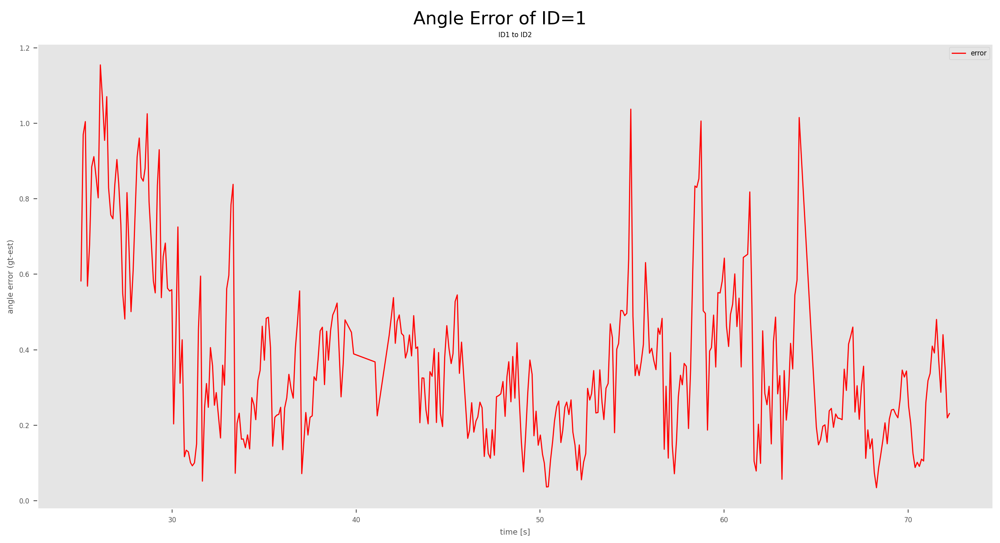
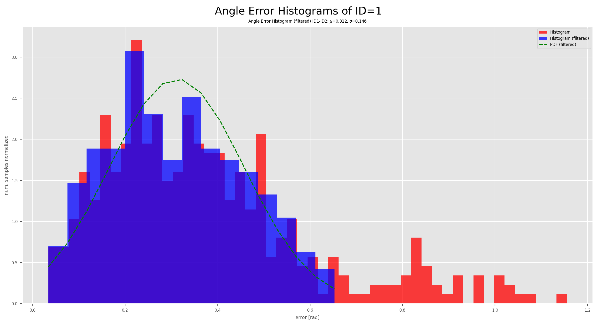

# cnspy_relative_pose_evaluation

A python3 package for evaluating relative pose measurements between two spatial frames in order to assess the accuracy.
The baseline (ground truth) relative pose can be computed from two recorded 3D trajectories of the moving bodies and known extrinsics to the sensors.
These can be specified in a single configuration file, see [config.yaml](./test/sample_data/config.yaml)


The following evaluations can be conducted:

| Describtion    | Images |
|:---------:|:---:|
| Pose Plot (left: measured, right: gt) |  |
| Pose Error Plot (left: position, right: orientation, top: meas, middle: error, bottom: nees)  |  |
| Range (gt vs. measured) outliers removed      |  |
| Range Sorted (gt vs. measured) outliers removed      |  |
| Range Error (measured-gt) outliers removed      |  |
| Range Error Histogram (filtered) and distribution |  |
| Angle (gt vs. measured) outliers set to zero      |  |
| Angle Error (measured-gt) outliers removed      |  |
| Angle Error Histogram (filtered) and distribution |  |
| Statistics | [statistics.yaml](./doc/statistics.yaml) |


## Installation

Python 3.6 or greater is required. Inside this repo's directory, you may run
```
pip3 install .
```
or
``
pip3 install -e .
``
which installs the package in-place, allowing you make changes to the code without having to reinstall every time.

**This package is still in development. Once stable it should be sufficient to run:**
```commandline
pip3 install cnspy_relative_pose_evaluation
```
## Run from terminal

* RelPoseMeasEvaluationTool 
* RelPoseMeasEvaluation
* RelPose_ROSBag2CSV
* ROSBag_TrueRelPoses
* ROSBag_Poses2RelPose

## YAML configuration file

YAML configuration file is in the form of:
```yaml
# relative pose of the moving sensors
sensor_positions: {0:[0, 0, 0], 1:[0, 0, 0], 2:[0, 0, 0]}
sensor_orientations: {0:[1.0, 0, 0, 0], 1:[1.0, 0, 0, 0], 2:[1.0, 0, 0, 0]}
# true pose of the body
sensor_topics: {0: "/uav10/vrpn_client/raw_pose", 1: "/uav11/vrpn_client/raw_pose", 2: "/uav12/vrpn_client/raw_pose"}
# topcis of the relative pose measurement
relpose_topics: {0: "/uav10/data_handler/uvdar_fcu", 1: "/uav11/data_handler/uvdar_fcu", 2: "/uav12/data_handler/uvdar_fcu"}

```

## Important notes for the NEES computation

The covariance of the measurements are assumed to represent the position uncertainty in meters and in the origin of reference frame of the observer, e.g. the camera. The covariance of the measured orientation is assumed to be in radian representing the uncertainty about the roll-pitch-yaw angles about the x-y-z-axes in zyx order (Rz(y)*Ry(p)*Rx(r)) of the body frame (local), thus `EstimationErrorType.type5`: 
* **TRUE = EST + ERR for positions R(3);** 
* **TRUE = EST \oplus ERR for rotations SO(3);**
* **global position error, local orientation error;**.

Please check out: [ErrorRepresentationType](https://github.com/aau-cns/cnspy_spatial_csv_formats/blob/main/cnspy_spatial_csv_formats/ErrorRepresentationType.py) and [EstimationErrorType](https://github.com/aau-cns/cnspy_spatial_csv_formats/blob/main/cnspy_spatial_csv_formats/EstimationErrorType.py)


## License

Software License Agreement (GNU GPLv3  License), refer to the LICENSE file.

*Sharing is caring!* - [Roland Jung](https://github.com/jungr-ait)  